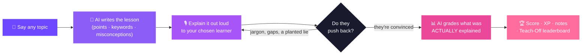
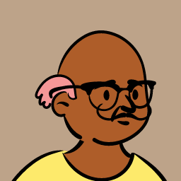
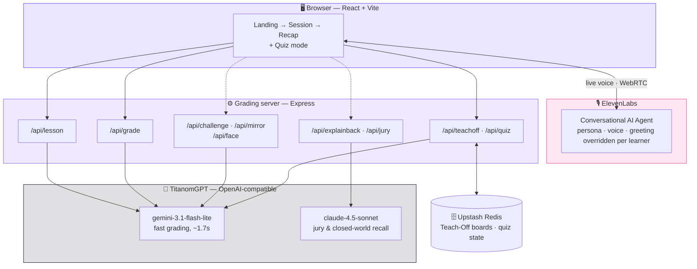
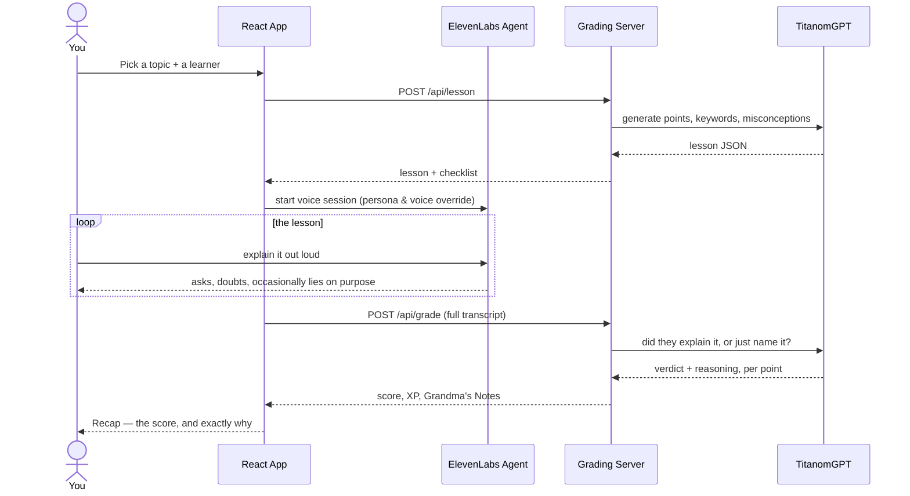

<div align="center">


[](https://titanom-hackathon-8xts.vercel.app/)

[](https://hack.titanom.com/)

*3 Monate ElevenLabs Scale · für das beste Projekt, das ElevenLabs nutzt*


</div>

<br/>

## Table of contents

- [What is this](#what-is-this)
- [See it in 30 seconds](#see-it-in-30-seconds)
- [Meet the six learners](#meet-the-six-learners)
- [Under the hood](#under-the-hood)
- [One lesson, start to finish](#one-lesson-start-to-finish)
- [Everything it can do](#everything-it-can-do)
- [Tech stack](#tech-stack)
- [Running it locally](#running-it-locally)
- [Deploying](#deploying)
- [Project structure](#project-structure)
- [The team and the hackathon](#the-team-and-the-hackathon)

<br/>

## What is this

Everyone knows the Feynman technique: if you can't explain something simply, you don't
really understand it. Every app that claims to teach it just asks you to *type* an
explanation and pattern-matches it against a rubric.

**Teach It To Grandma makes you say it out loud, to someone who can push back.**

Pick any topic. An AI grandmother — voice, personality, and all — listens live and asks
the questions a real beginner would ask: *"but what does that word mean, darling?"*, *"how
did you get from that to this?"*. Switch on Misconception Ambush mode and she'll
occasionally state something confidently wrong, just to see if you catch it. When you're
done, a separate grading pass reads the whole
conversation and judges whether each point was **genuinely explained**, not just
name-dropped — the difference between a checklist lighting up green and someone actually
learning something.

> The moment this app is built around: the keyword bar reads 4 / 4, and the AI says she
> didn't follow a word of it. That gap is the entire product.

<br/>

## See it in 30 seconds



<br/>

## Meet the six learners

One ElevenLabs agent, six personas — each with its own voice, vocabulary, question
style, and **grading strictness**. The Manager wants the bottom line; the Professor
quotes your own contradictions back at you. All six share one unbreakable rule: they are
the learner, never the teacher. They will never define a term for you.

<div align="center">

| | | | | | |
|:---:|:---:|:---:|:---:|:---:|:---:|
|  |  |  |  |  |  |
| **Grandma** | **Mia**, 7 | **Sam** | **Marcus** | **Victor** | **Prof. Ellis** |
| Knows nothing.<br/>Loves you anyway. | Asks *why*.<br/>Then asks why again. | Knows the words,<br/>not the how. | Wants the<br/>bottom line. | Knows the field<br/>next door. | Remembers<br/>everything you said. |
| Beginner | Beginner | Intermediate | Intermediate | Advanced | Advanced |

</div>

<br/>

## Under the hood



Two things that shape every design decision here:

- **Grading never blocks the demo.** If the AI grader is slow or fails, the recap still
  renders from the live in-browser keyword check — a worse verdict, never a stuck screen.
- **The score is computed, never model-emitted.** The AI answers yes/no per point with
  reasoning; the headline number is arithmetic over those booleans, so it's reproducible
  and every input is something an engineer can point at.

<br/>

## One lesson, start to finish



<br/>

## Everything it can do

<table>
<tr><td width="50%" valign="top">

**The core loop**
- Any topic, typed free-text — AI writes the lesson
- Live voice conversation, not a chat window
- Real-time keyword checklist while you talk
- AI grading of genuine understanding, not keyword-matching
- Self-correction bonus for catching your own mistakes
- Your own identity — compose a name and a face once, reused every lesson

**Six learners, one agent**
- Distinct voice, vocabulary, and grading strictness each
- Her mood and face react live as you talk — confused, curious, impressed
- Difficulty prediction: guesses which points will trip you up
  *before* you start, then scores itself against what happened

**Pressure-testing**
- Misconception Ambush *(opt-in)* — a confidently wrong claim to catch
- Topic-specific challenge cards, fired mid-conversation
- Confidence gap — predict your score, then see the truth
- Blind spots — ground you never went near, not just badly

</td><td width="50%" valign="top">

**The verdict**
- Grandma's Notes — your strongest quote, one concrete thing to fix
- She explains it *back* — only what survived, gaps and all
- Mirror mode — she retells it with planted errors, you catch them
- Delivery analysis — pace, filler, hedging, from the transcript
- One shareable recap card, composed from numbers already on screen

**Progression**
- A Feynman Score computed from real signals, never guessed
- Itemised XP with the actual quote that earned it
- Achievements that stay locked — with their condition visible —
  until they're honestly earned

**Compare & compete**
- Teach-Off — two people, the *same* generated lesson, one board
- A four-persona AI jury judging one explanation by different standards
- A live 2-player quiz mode, on the clock
- Full German-language mode — lesson, grading, and voice together

</td></tr>
</table>

<br/>

## Tech stack

| Layer | Choice | Why |
|---|---|---|
| Frontend | React 19 + Vite | `@elevenlabs/react` for the voice session, no framework overhead |
| Voice | ElevenLabs Conversational AI | One agent, six personas via per-session prompt/voice overrides |
| Grading server | Express 5 | Two models: a fast one for the live loop, a stronger one for judgement calls |
| Model access | TitanomGPT (OpenAI-compatible) | `gemini-3.1-flash-lite` for speed, `claude-4.5-sonnet` where a wrong answer needs to be subtle to be dangerous |
| Persistence | Upstash Redis | Teach-Off boards and quiz state survive serverless cold starts |
| Hosting | Vercel (×2 projects) | Zero-config detection for Vite and Express from one repo |

<br/>

## Running it locally

```bash
# terminal 1 — grading server
cd server
npm install
npm run dev        # http://localhost:3001

# terminal 2 — frontend
cd frontend
npm install
npm run dev         # http://localhost:5173
```

The grading server reads `TITANOM_API_KEY` from a project-root `.env` (gitignored —
never put it in the frontend). Point the frontend at a deployed server instead of
localhost by setting `VITE_GRADING_API` in `frontend/.env.local`.

Run `./smoke-test.sh` before a live demo to sanity-check both processes are up and the
grading endpoint responds.

<br/>

## Deploying

Two Vercel projects from this one repo — `server` and `frontend` as separate root
directories, connected to Upstash Redis for shared state. Full walkthrough, including the
CORS and health-check gotchas, is in [`DEPLOY.md`](DEPLOY.md).

<br/>

## Project structure

```
.
├── frontend/                 React + Vite client
│   ├── src/
│   │   ├── views/             Landing · Intro · Session · Recap · Quiz
│   │   ├── components/        KeyPrompt · ThemeToggle · Thinking · JargonDebt
│   │   ├── characters.js      the six personas, as data
│   │   ├── features.js        every optional feature, one flag each
│   │   └── ...
│   └── public/                 the peep character art
├── server/                   Express grading API
│   ├── index.js                every /api route
│   ├── store.js                Redis-backed Teach-Off & quiz state
│   └── tts.js
├── DEPLOY.md                 deployment walkthrough
├── TESTING.md                 test plan & smoke test notes
└── smoke-test.sh
```

<br/>

## The team and the hackathon

Built overnight at **Student Hackathon 2026 — Titanom × DeutschlandGPT**, Titanom
Headquarter, Germering, Germany. Theme: *"Eine Nacht, acht Teams, ein Thema: Bildung ×
KI"* — one night, eight teams, one theme: education × AI.

<div align="center">

### 🏆 ElevenLabs Sonderpreis
**Best Project Built With ElevenLabs**
3 Monate ElevenLabs Scale

</div>

<br/>

<div align="center">

</div>
